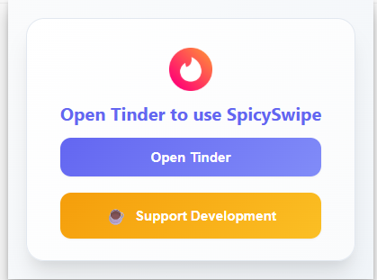

# SpicySwipe - AI-Powered Tinder Automation

[](LICENSE)
[](https://developer.chrome.com/docs/extensions/mv3/)
[](https://openai.com/)

👉 **[View Full Changelog](CHANGELOG.md)**

## �Current version�
## [1.2.4] - 2025-06-28
**🚀 MAJOR UPDATE: Enhanced User Experience & Privacy Controls**

### 🔐 **Privacy & Consent Management**
- **Reset Consent & Revoke Access**: One-click button to reset all extension permissions and consent
- **User Autonomy**: Complete control over extension access without developer tools
- **Privacy Compliance**: Enhanced alignment with privacy regulations
- **Automatic Reload**: Seamless reset process with page reload to re-display consent overlay

### 🌍 **Internationalization & Localization**
- **9 Languages**: Full support for English, French, Spanish, German, Italian, Portuguese, Arabic, Chinese, Korean, Japanese
- **Smart Detection**: Automatic browser language detection
- **Language Selector**: Manual language switching with persistent preferences
- **Robust Fallback**: Graceful fallback to English for missing translations
- **i18n System**: Professional internationalization utility with parameter support

### 🎨 **UI/UX Enhancements**
- **Dark Mode**: Complete dark/light theme toggle with persistent preferences
- **Enhanced Styling**: Improved CSS for language selectors and UI elements
- **Visual Polish**: Better visual hierarchy and user experience across all interfaces
- **Debug Mode**: A toggle switch in the popup to control debug logging for troubleshooting.
- **Theme Persistence**: User preferences remembered across sessions


### How to use the new tones
You can now select a message tone (e.g., Extra Naughty, Meme Lord, Super Romantic, etc.) in the AI tab, Settings, or when approving/translating a message. The AI will generate messages in the selected style, making your conversations more personalized and engaging.

## Overview

SpicySwipe is a sophisticated Chrome extension that revolutionizes your Tinder experience through advanced AI-powered automation. Built with cutting-edge artificial intelligence, it provides intelligent messaging, comprehensive profile analysis, and seamless conversation management using multiple state-of-the-art AI models.

## ✨ Key Features

### 🤖 Multi-AI Model Integration
- **OpenAI ChatGPT** - Advanced conversational AI with context awareness
- **Google Gemini** - Fast, reliable responses with real-time processing free Geminie api version works with this extension 
- **DeepSeek** - Specialized creative content generation
- **Anthropic Claude** - Sophisticated reasoning and analysis

### 💬 Intelligent Messaging System
- **Smart Profile Analysis** - Comprehensive extraction and analysis of match profiles
- **Context-Aware Responses** - Personalized message generation based on conversation history
- **Multi-Language Support** - 60+ languages with automatic detection and translation
- **Adaptive Tone Control** - Dynamic messaging styles (friendly, playful, flirty, witty)

### 🎯 Advanced Automation
- **One-Click AI Generation** - Instant message creation with wand button interface
- **Persistent AI Assistant** - Always-accessible AI support through floating icon
- **Smart Auto-Send** - Configurable automatic message delivery
- **Message Approval System** - Review and edit capabilities before sending

### 📊 Comprehensive Analytics
- **Real-Time Performance Tracking** - Live statistics for swipes, matches, and messages
- **AI Model Performance Metrics** - Response quality and success rate monitoring
- **Session Analytics** - Detailed activity tracking and insights
- **Historical Data Analysis** - Long-term performance trends and patterns

### 🛡️ **Enterprise-Grade Security**
- **Privacy-First Design** - No data collection, local processing only
- **Secure Storage** - All data stored locally in your browser
- **No External APIs** - Zero external dependencies or data sharing
- **User Control** - Complete transparency and user autonomy
- **Consent Management** - One-click consent reset and privacy control

## 🚀 Get Started

### Download

- **[Get it on Edge Add-ons](https://microsoftedge.microsoft.com/addons/detail/bmplipcnocejcfimbfclhhgijmenhapc)**

> **Note:** Due to the review process on the Edge Store, new versions may be delayed. For the latest version, you can always download the ZIP from the [releases page](https://github.com/ramailo1/SpicySwipe/releases/latest) and install it manually.

## 🚀 Quick Start

### Installation

1. **Download** the SpicySwipe extension package
2. **Navigate** to `chrome://extensions/` in your browser
3. **Enable** Developer Mode (toggle in top-right corner)
4. **Click** "Load unpacked" and select the SpicySwipe directory
5. **Pin** the extension to your toolbar for quick access

### Initial Configuration

1. **Launch** SpicySwipe from your Chrome toolbar
2. **Access** the AI configuration tab in the sidebar
3. **Select** your preferred AI model from the available options
4. **Configure** your API credentials for the selected model
5. **Save** your settings to activate the extension

### Message Customization

- **Tone Selection** - Choose from multiple messaging personalities
- **Language Preferences** - Configure translation and language settings
- **Auto-Send Configuration** - Enable or disable automatic message delivery
- **Response Length Control** - Adjust message complexity and length

## 📋 Usage Guide

### Basic Operation

1. **Navigate** to Tinder.com and authenticate your account
2. **Activate** the SpicySwipe sidebar using the toggle interface
3. **Configure** your AI settings in the dedicated tab
4. **Begin** your automated swiping experience

### AI Message Generation

1. **Open** a conversation with any match
2. **Click** the AI wand button on their profile or use the persistent assistant
3. **Review** the generated message in the approval interface
4. **Edit** the content if necessary and confirm delivery

### Analytics Monitoring

1. **Access** the Analytics dashboard in the sidebar
2. **Monitor** real-time performance metrics
3. **Track** AI model effectiveness and success rates
4. **Analyze** long-term trends and optimization opportunities

### Consent Management

1. **Access** the Swiping tab in the sidebar
2. **Locate** the "Reset Consent & Revoke Access" button at the bottom
3. **Click** the button and confirm the action in the dialog
4. **Wait** for automatic page reload to show consent overlay
5. **Re-accept** consent to continue using the extension

## 📸 Screenshots

<div align="center">
  
</div>

### 🚀 Major Update v1.2.4 Features

<div align="center">
  <table>
    <tr>
      <td align="center">
        
        <br><strong>AI Messaging Interface</strong>
      </td>
      <td align="center">
        
        <br><strong>Extension Popup</strong>
      </td>
    </tr>
    <tr>
      <td align="center">
        
        <br><strong>Analytics Dashboard</strong>
      </td>
      <td align="center">
        
        <br><strong>AI Suggestions</strong>
      </td>
    </tr>
  </table>
</div>

## 🔑 API Configuration

### Required API Keys

| AI Provider | Model | API Key Location | Pricing | Testing Status |
|-------------|-------|------------------|---------|----------------|
| **OpenAI** | gpt-4o | [OpenAI Platform](https://platform.openai.com/api-keys) | Pay-per-use | ⚠️ Not tested (requires paid API) |
| **Google** | gemini-2.0-flash | [Google AI Studio](https://makersuite.google.com/app/apikey) | Free tier available | ✅ Tested with free tier |
| **DeepSeek** | deepseek-chat | [DeepSeek Platform](https://platform.deepseek.com/) | Pay-per-use | ⚠️ Not tested (requires paid API) |
| **Anthropic** | claude-3-opus-20240229 | [Anthropic Console](https://console.anthropic.com/) | Pay-per-use | ⚠️ Not tested (requires paid API) |

### ⚠️ Testing Status Note

**Current Testing**: Only Google Gemini (free tier) has been fully tested and verified to work with SpicySwipe.

**Other AI Models**: The extension is designed to work with all listed AI providers, but due to API costs, only Gemini has been tested. Theoretically, all other AI models (OpenAI, DeepSeek, Anthropic) should work with their respective paid API keys, but this has not been verified in practice.

**Recommendation**: Start with Google Gemini (free tier) for testing, then upgrade to paid APIs as needed.

### Security Best Practices

- **Secure Storage** - API keys are encrypted and stored locally
- **No Data Collection** - All processing occurs on your device
- **Direct Communication** - Secure API calls to AI providers
- **Privacy Protection** - No user activity tracking or monitoring

## 🛡️ Safety & Compliance

### Educational Use Framework

This extension is designed for educational purposes and research into AI-human interaction patterns. Users must ensure compliance with:

- **Platform Terms of Service** - Tinder and AI provider agreements
- **Local Regulations** - Applicable laws and guidelines
- **Ethical Guidelines** - Responsible AI usage practices

### Privacy & Security

- **Zero Data Collection** - No personal information is transmitted
- **Local Processing** - All data remains on your device
- **Secure Communication** - Encrypted API interactions
- **No Tracking** - Complete privacy protection

## 🏗️ Technical Architecture

### System Design

- **Manifest V3** - Latest Chrome extension standards
- **Content Scripts** - Efficient DOM manipulation and UI integration
- **Background Service Worker** - Robust API communication and data management
- **Local Storage API** - Secure data persistence and caching

### Performance Optimization

- **Optimized Selectors** - High-performance DOM element detection
- **Debounced Observers** - Efficient change detection algorithms
- **Context Validation** - Comprehensive error handling and recovery
- **Memory Management** - Automatic resource cleanup and optimization

## 🔧 Troubleshooting

### Common Issues

| Issue | Solution |
|-------|----------|
| **Extension context invalidated** | Reload the extension from chrome://extensions/ |
| **API key not found** | Verify API key configuration in settings |
| **Message generation failed** | Check API quota and internet connectivity |
| **Sidebar not appearing** | Ensure you're on Tinder.com and refresh the page |

### Support Resources

1. **Verify API Configuration** - Ensure valid keys with sufficient quota
2. **Check Permissions** - Confirm extension access to Tinder.com
3. **Clear Extension Data** - Reset if experiencing persistent issues
4. **Update Extension** - Ensure latest version compatibility

## 📁 Project Structure

```
SpicySwipe/
├── manifest.json              # Extension configuration
├── content.js                 # Core extension logic
├── background.js              # API communication layer
├── selectors.js               # DOM element selectors
├── assets/                    # Extension assets and icons
├── popup/                     # User interface components
├── friend/                    # Configuration pages
├── utils/                     # Utility functions
│   ├── antiDetection.js       # Stealth mode implementation
│   └── encryption.js          # Security utilities
└── tests/                     # Test suite
    ├── aiIntegration.test.js  # AI integration tests
    └── swipeLogic.test.js     # Core logic tests
```

## 🤝 Contributing

### Development Guidelines

1. **Fork** the repository
2. **Create** a feature branch (`git checkout -b feature/amazing-feature`)
3. **Commit** your changes (`git commit -m 'Add amazing feature'`)
4. **Push** to the branch (`git push origin feature/amazing-feature`)
5. **Open** a Pull Request

### Code Standards

- **ESLint Configuration** - Maintained code quality standards
- **TypeScript Support** - Optional type safety implementation
- **Testing Framework** - Comprehensive test coverage
- **Documentation** - Clear code documentation and comments

## 📄 License

SpicySwipe is licensed for **personal and non-commercial use only**.  
Commercial licensing is available upon request — contact [ramailorakou@gmail.com)](mailto:ramailorakou@gmail.com).

### License Terms

- **Personal Use** - Free for individual, educational, and research purposes
- **Non-Commercial** - No commercial distribution or monetization
- **Attribution** - Credit must be given to the original author
- **Commercial Licensing** - Available for business and commercial applications

## 👨‍💻 Author

**Soufienne Rahali**
- **Email**: ramailorakou@gmail.com
- **GitHub**: [@ramailo1](https://github.com/ramailo1)
- **Project**: [SpicySwipe Repository](https://github.com/ramailo1/SpicySwipe)

## 💝 Support the Project

If you find SpicySwipe helpful, consider:
- ⭐ **Star the repository** on GitHub
- 🐛 **Report bugs** and suggest features
- ☕ **Buy me a coffee** - [Support the developer](https://coff.ee/soufienne)
- 💼 **Commercial licensing** for business use
- 📧 **Contact** for custom development services

## ⚠️ Disclaimer

This extension is designed for love and chat. Users are responsible for ensuring compliance with all applicable terms of service, platform policies, and local regulations. The developers assume no liability for misuse or violation of platform terms.

---

**Built with ❤️ for the AI research community** 

## 🌍 Multi-Language Support

SpicySwipe now supports multiple languages and automatically detects your browser's language preference. The extension is currently available in:

- 🇺🇸 **English** (Default)
- 🇫🇷 **Français** (French)
- 🇪🇸 **Español** (Spanish)
- 🇩🇪 **Deutsch** (German)
- 🇮🇹 **Italiano** (Italian)
- 🇵🇹 **Português** (Portuguese)

### How it works:

1. **Automatic Detection**: The extension automatically detects your browser's language and loads the appropriate translation
2. **Manual Selection**: You can manually change the language using the language selector in the sidebar
3. **Persistent Settings**: Your language preference is saved and will be remembered across sessions
4. **Fallback Support**: If a translation is missing, the extension falls back to English

### Changing Languages:

1. Open the SpicySwipe sidebar on Tinder.com
2. Look for the language dropdown in the top-right corner of the sidebar
3. Select your preferred language from the dropdown
4. The interface will immediately update with the new language

### Adding New Languages:

To add support for additional languages, create a new translation file in the `locales/` directory following the same structure as the existing files.

## Features
